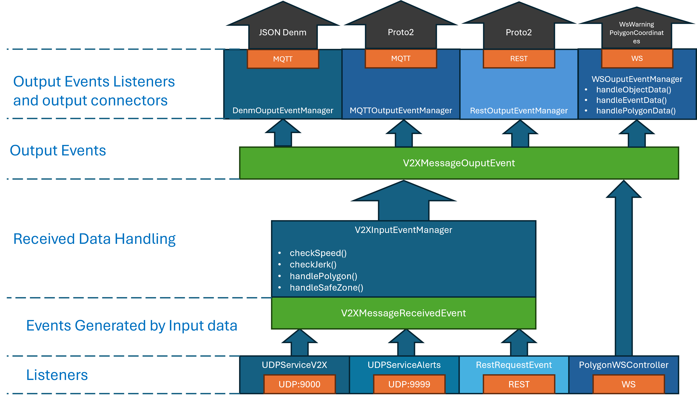

## ITS Platform

SpringBoot based platform. The platform has multiple connectors that allows it to receive data using UDP, REST and WS. Then, it generates events for the data to be consumed. Finally, it generates output events for the active connectors to send the data for their respective ends.

